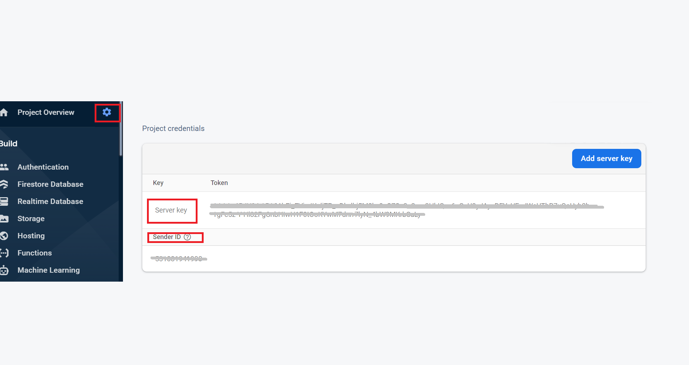
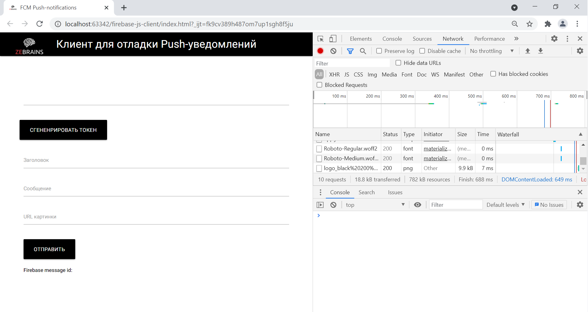
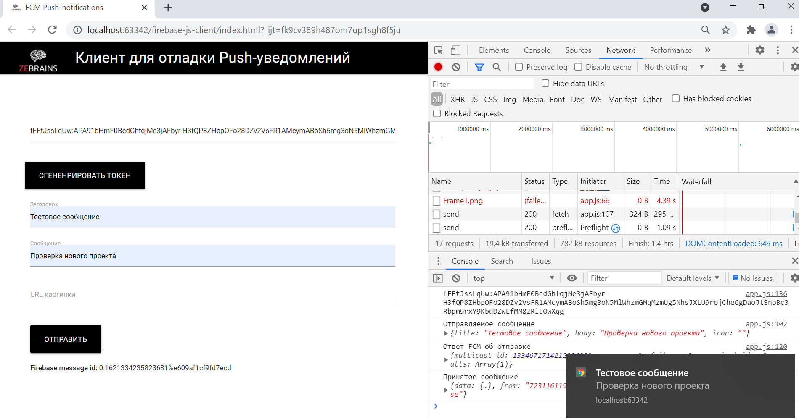

# Описание проекта
Проект предназначен для тестирования отправки и приема PUSH-уведомлений с помощью Firebird Cloud Messaging.

Стэк: JS, FCM SDK

# Подготовка проекта

### 1) Скопируйте из консоли Firebase SenderId и Server key
Для этого перейдите в [консоль Firebase](https://console.firebase.google.com) > Выберите проект > Настройки > Cloud Messaging

### 2) Замените messagingSenderId
Замените <b>messagingSenderId</b> в <b>app.js</b> и <b>firebase-messaging-sw.js</b> на скорпированный на первом шаге SenderId
### 3) Замените key
Замените <b>key</b> в <b>app.js</b> на Server key 
### 4) Настройте serviceWorker
В <b>firebase.js</b> измените путь при регистрации ServiceWorker <br>
        ```
        navigator.serviceWorker.register("/<имя проекта>/firebase-messaging-sw.js",{scope:"/<имя проекта>/firebase-cloud-messaging-push-scope"})```
        
В <b>app.js</b> <br>
        ```navigator.serviceWorker.register('/<имя проекта>/firebase-messaging-sw.js');```
### 5) Запустите проект на локальном сервере 
Пример запуска приложения через PyCharm
##### 1) Откройте папку с приложением как проект в PyCharm
##### 2) Откройте файл index.html
##### 3) Нажмите на иконку любого установленного браузера

 # Работа с приложением

Проект позволяет отправлять и принимать push-уведомления в браузере. <p>

Для получения токена устройства необходимо нажать на кнопку 'Сгенерировать'. Полученный токен будет отображаться 
на странице и выводиться в консоль браузера. При нажатии кнопки обновить токен удалится.<p>

Для отправки  уведомления необходимо заполнить поля: заголовок, сообщение и ссылка на изображение. Затем необходимо 
нажать кнопку "Отправить". Если все настроено правильно, то вам придет уведомление, а в консоли выведется информация 
по принятому уведомлению. <p>

Для отправки сообщения на устройство вставьте токен устройства в поле "Токен". 
Заполните поля тестовыми данными и нажмите кнопку "Отправить". Если все настроено правильно, на устройсво, 
токен которого указали в поле "Токен", придет уведомление




